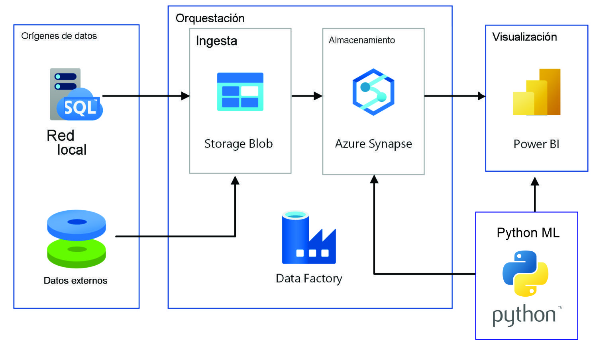

<h1 align='center'>
 <b>PROYECTO GRUPAL Nº2</b>
</h1>
 
# <h1 align="center">**`ESPERANZA DE VIDA AL NACER`**</h1>

## **Contexto**

La OMS necesita un análisis detallado de la esperanza de vida en Latinoamérica y el Caribe debido a la importancia de contar con información precisa y actualizada sobre el estado de salud de la población en esta región. La esperanza de vida es un indicador crucial que permite evaluar la calidad de vida, la eficacia de los sistemas de salud y el progreso socioeconómico de un país o región.

Al comprender en profundidad la esperanza de vida en Latinoamérica y el Caribe, la OMS estará en una posición favorable para abordar los desafíos de salud específicos que enfrenta esta región. Este análisis permitirá identificar brechas y desigualdades en la esperanza de vida entre los diferentes países, lo que es fundamental para desarrollar estrategias efectivas que mejoren la salud y promuevan la equidad.

## **Objetivos:**

El objetivo de este trabajo es analizar cómo la esperanza de vida al nacer se ve afectada por diferentes factores socioeconómicos, tales como el nivel de desarrollo económico, medido por el Producto Interno Bruto (PIB), el grado de pobreza, el acceso a la educación y las oportunidades de empleo. Se pretende identificar las principales variables que influyen en la calidad y la duración de la vida de las personas, así como las posibles políticas públicas que podrían mejorarlas.	

## **Alcance:**

Dado que el proyecto abarca una temática amplia, se establecerán los siguientes límites:
Se utilizarán 10 conjuntos de datos del Banco Mundial relacionados con indicadores socioeconómicos de América Latina y el Caribe.
Se explorarán fuentes externas relevantes para complementar el análisis.
El enfoque se centrará en factores socioeconómicos, excluyendo factores biológicos.
Se considerarán aspectos opcionales como cuestiones culturales, hábitos humanos, acceso a la salud y brecha de género para enriquecer el análisis.
Se tendrá en cuenta la información de un lapso de tiempo de no menos  30 años, y se recomendará en un rango no mayor a 30 años

## **Solución propuesta:**

Solución propuesta::
   - Recopilar y explorar los conjuntos de datos seleccionados del Banco Mundial.
   - Investigar fuentes externas relevantes para complementar el análisis.
   - Realizar análisis exploratorio de datos para comprender la estructura y calidad de los datos.
   - Realizar análisis estadísticos y visuales para identificar patrones y relaciones.
    -Presentar en un dashboard interactivo para mejor comprensión de los resultados.
   - Proponer recomendaciones basadas en los resultados del análisis.
   - Desarrollar modelos predictivos o descriptivos para evaluar la influencia de los factores socioeconómicos.

 ## **Stack tecnológico:**
1. Python: Se utilizará el lenguaje de programación, Python para realizar la verificación y limpieza de los datos obtenidos ,datos como faltantes, nulos, normalización de nombres de columnas y la decisión de eliminar columnas que no sean relevantes para nuestro análisis, después de esto hacer  procesamiento y análisis de los conjuntos de datos, aplicar técnicas estadísticas y desarrollar modelos predictivos o descriptivos. También se aprovechará la amplia gama de bibliotecas de Python, como pandas, NumPy, matplotlib y seaborn, para realizar tareas de manipulación de datos, visualización y análisis estadístico.
algoritmos

2. GitHub: se utilizará para mantener un historial de cambios, trabajar en colaboración, compartir código y los recursos del proyecto.

3. SQL: Se utilizará para extraer datos de bases de datos, realizar consultas y manipulaciones de datos adicionales. 
Motor: mysql, postgresql, aurora, etc etc

4. Power BI:  Lo usaremos para crear visualizaciones interactivas basadas en los resultados de nuestro análisis y compartir los informes con el equipo de la OMS. Esto facilitará la comprensión y comunicación efectiva de los hallazgos.

5. Streamlit: Lo usaremos para desarrollar una aplicación web interactiva que nos permita compartir entre nuestro equipo visualizaciones y resultados de nuestro análisis de manera fácil y amigable.

6. Azure: es una solución muy rápida y sencilla de utilizar para crear entornos de trabajo en la nube. Su alta velocidad de despliegue permite tener listas aplicaciones y otros servicios cloud en muy poco tiempo y sin la necesidad de realizar un gran esfuerzo.

Azure Data Factory: Es un servicio de orquestación de datos basado en la nube que permite la ingesta, transformación y carga de datos en varios almacenes de datos y servicios en la nube o en las instalaciones. Proporciona herramientas visuales para crear y programar flujos de trabajo de extracción, transformación y carga (ETL) para mover y transformar datos de diferentes fuentes.

Azure Blob Storage: Es un servicio de almacenamiento en la nube escalable y económico que permite la ingesta y el almacenamiento de grandes volúmenes de datos no estructurados, como archivos de registro, imágenes, videos, etc. Puede utilizarse como destino para la ingesta inicial de datos antes de realizar transformaciones o análisis adicionales.
Azure Data Lake Storage: Es un repositorio de almacenamiento en la nube altamente escalable y seguro para grandes volúmenes de datos estructurados y no estructurados. Permite la ingesta masiva de datos y es compatible con múltiples formatos de datos, lo que facilita el procesamiento y análisis posterior.

## **Metodología de trabajo:** 
 Utilizaremos Scrum como metodología ágil para la organización y gestión del proyecto ya que posee las siguientes cualidades:
1. Flexibilidad y adaptabilidad: lo cual es especialmente beneficioso en un proyecto de análisis de datos que puede requerir cambios y ajustes en el transcurso del trabajo. 
2. Entregas incrementales: Scrum se basa en la entrega de incrementos de trabajo completados en intervalos de tiempo cortos y regulares, conocidos como "sprints". Esto permite obtener resultados tangibles en etapas tempranas del proyecto y facilita la retroalimentación y la validación temprana por parte del equipo de la OMS. Además, los entregables incrementales aseguran que los resultados se vayan generando de manera continua, lo que es fundamental para un proyecto de análisis de datos.

3. Colaboración y comunicación: Scrum fomenta la colaboración activa entre los miembros del equipo y la comunicación fluida con los stakeholders. En el presente proyecto  es esencial tener interacciones frecuentes entre los expertos en datos, los analistas y el equipo de la OMS para asegurar un entendimiento claro de los requisitos, abordar dudas o problemas y tomar decisiones basadas en los hallazgos.

4. Enfoque en el valor del negocio: Scrum se enfoca en entregar valor al cliente de manera temprana y constante. Esto es especialmente relevante en el contexto de la OMS, ya que se busca obtener información precisa y actualizada sobre la esperanza de vida en la región. La entrega de resultados parciales y valiosos a lo largo del proyecto permitirá a la OMS tomar decisiones fundamentadas y comenzar a implementar estrategias de mejora en base a los hallazgos obtenidos.

5. Mejora continua: Scrum promueve la mejora continua a través de la retroalimentación y la reflexión periódica en las reuniones de revisión y retrospectiva. Estas reuniones proporcionan la oportunidad de evaluar el progreso, identificar áreas de mejora y ajustar la planificación y el enfoque en función de los resultados obtenidos. En un proyecto de análisis de datos, es crucial contar con mecanismos para aprender y ajustar el enfoque a medida que se avanza en el análisis.

Dicha metodología será desempeñada en un contexto que cuenta con reuniones diarias entre nuestro equipo de trabajo con nuestro organizador, una reunión semanal con un representante de la OMS, y reuniones de consulta, acuerdos y abordaje de problemáticas emergentes a cualquier horario garantizando que sea de lunes a viernes entre nuestro equipo.
   
## **Diseño detallado - Entregables:** 
   -Realizaremos un Dashboard interactivo con  análisis de los factores socioeconómicos que influyen en la esperanza de vida.
    - También vamos a realizar un informe con recomendaciones claras y evaluables para mejorar la esperanza de vida.
    -  Predicciones

## **Equipo de trabajo:** 

**Esteban Santillan:**
Analista de datos encargado de recopilar, filtrar e interpretar las 
bases de datos para ayudar a la organización en la toma de  
decisiones.

Edward Galindo	Ingeniero de datos arquitecto de la base de datos, desarrollador 
de los ETLs, Implementador de pipelines, tester, etc.

**Martin Nardelli:**	
Data Science encargado de la visualización para que todos 
puedan utilizar los datos y entenderlos de forma clara, un 
experto en Data Science tiene que ser capaz de representarlos 
de forma que sean comprensibles.

**Oscar Arias:**		
Ingeniero de datos arquitecto de la base de datos, desarrollador 
de los ETLs, Implementador de pipelines, tester, etc

## **Ciclo de vida del dato:** 
INGESTA- Dataset, API, IOT, etc (Data Lake)
TRANSFORMACIÓN: Normalización(gobernanza), Nulos, Duplicados, Outliers, etc ETL. (Data Factory)
DISPONIBILIZACIÓN: (Data Warehouse) SQL.
VISUALIZACIón: PwBI
MAchine Learning: python.

## **ARCHIVOS DENTRO DEL REPOSITORIO** 
**EDA.ipynb:**	
Contiene el análisis exploratorio de datos de los indicadores que se tomaron en cuenta despues de realizar el ETL a la base de dats global del banco mundial

**ETL.ipynb:**	
Contiene el proceso de extracción, transformación y carga de datos desde la fuente de datos del banco mundial

**indicadores_latinoamerica.csv:**
Contiene e resultado de hacer el ETL a la fuente de datos del banco mundial
	

