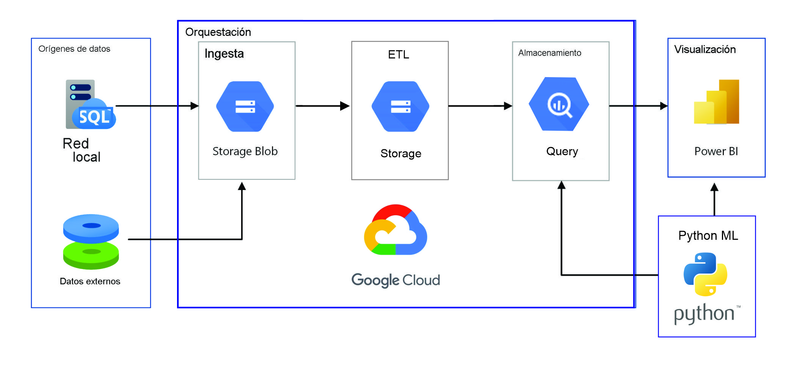

<h1 align='center'>
 <b>PROYECTO GRUPAL Nº2</b>
</h1>
 
# <h1 align="center">**`ESPERANZA DE VIDA AL NACER`**</h1>

## **Contexto**

La OMS necesita un análisis detallado de la esperanza de vida en Latinoamérica y el Caribe debido a la importancia de contar con información precisa y actualizada sobre el estado de salud de la población en esta región. La esperanza de vida es un indicador crucial que permite evaluar la calidad de vida, la eficacia de los sistemas de salud y el progreso socioeconómico de un país o región.

Al comprender en profundidad la esperanza de vida en Latinoamérica y el Caribe, la OMS estará en una posición favorable para abordar los desafíos de salud específicos que enfrenta esta región. Este análisis permitirá identificar brechas y desigualdades en la esperanza de vida entre los diferentes países, lo que es fundamental para desarrollar estrategias efectivas que mejoren la salud y promuevan la equidad.

## **Objetivos:**

El objetivo de este trabajo es analizar cómo la esperanza de vida al nacer se ve afectada por diferentes factores tales como el nivel de desarrollo económico, medido por el GNI per capita, la tasa de fertilidad, la mortalidad infantil y las oportunidades de empleo. Se pretende identificar las principales variables que influyen en la calidad y la duración de la vida de las personas, así como las posibles políticas públicas que podrían mejorarlas.	

## **KPIs:**

Reducir la tasa de fertilidad en no más de un 6% en razón de la tasa de fertilidad a nivel regional alcanzada para el 2021 en comparación con el 2016.

Aumentar la esperanza de vida en al menos un 3% en razón de la esperanza de vida a nivel regional alcanzada para el 2021 en comparación con el 2011.

Reducir la tasa de mortalidad infantil en al menos un 10% en razón de la tasa de mortalidad infantil a nivel regional alcanzada para el 2021 en comparación con el 2016.

Aumentar el GNI per capita en al menos un 10% en razón del GNI per capita a nivel regional alcanzado para el 2021 en comparación con el 2016.

## **Alcance:**

Dado que el proyecto abarca una temática amplia, se establecerán los siguientes límites:
Se utilizarán 10 conjuntos de datos del Banco Mundial relacionados con indicadores socioeconómicos de América Latina y el Caribe.
Se explorarán fuentes externas relevantes para complementar el análisis.
El enfoque se centrará en factores socioeconómicos, excluyendo factores biológicos.
Se considerarán aspectos opcionales como cuestiones culturales, hábitos humanos, acceso a la salud y brecha de género para enriquecer el análisis.
Se tendrá en cuenta la información de un lapso de tiempo de no menos  30 años, y se recomendará en un rango no mayor a 30 años

## **Solución propuesta:**

Solución propuesta::
   - Recopilar y explorar los conjuntos de datos seleccionados del Banco Mundial.
   - Investigar fuentes externas relevantes para complementar el análisis.
   - Realizar análisis exploratorio de datos para comprender la estructura y calidad de los datos.
   - Realizar análisis estadísticos y visuales para identificar patrones y relaciones.
    -Presentar en un dashboard interactivo para mejor comprensión de los resultados.
   - Proponer recomendaciones basadas en los resultados del análisis.
   - Desarrollar modelos predictivos o descriptivos para evaluar la influencia de los factores socioeconómicos.

 ## **Stack tecnológico:**

1. Python: Se utilizará el lenguaje de programación, Python para realizar la verificación y limpieza de los datos obtenidos ,datos como faltantes, nulos, normalización de nombres de columnas y la decisión de eliminar columnas que no sean relevantes para nuestro análisis, después de esto hacer  procesamiento y análisis de los conjuntos de datos, aplicar técnicas estadísticas y desarrollar modelos predictivos o descriptivos. También se aprovechará la amplia gama de bibliotecas de Python, como pandas, NumPy, matplotlib y seaborn, para realizar tareas de manipulación de datos, visualización y análisis estadístico.
algoritmos

2. GitHub: se utilizará para mantener un historial de cambios, trabajar en colaboración, compartir código y los recursos del proyecto.

3. Power BI:  Lo usaremos para crear visualizaciones interactivas basadas en los resultados de nuestro análisis y compartir los informes con el equipo de la OMS. Esto facilitará la comprensión y comunicación efectiva de los hallazgos.

4. Google cloud: Nos ofrece escalabilidad, rendimiento y almacenamiento seguro para la ingesta, tratamiento y carga de datos a Power BI. Proporciona integración con Power BI, herramientas de procesamiento de datos avanzadas, seguridad y cumplimiento normativo, monitoreo, administración, y flexibilidad en las opciones de implementación. 

5. Google Cloud Storage: Permite almacenar grandes volúmenes de datos de forma escalable y segura. Los datos pueden ser consultados y accedidos de manera eficiente utilizando las APIs y herramientas proporcionadas por Google Cloud.

6. Google BigQuery: Permite realizar consultas y análisis en grandes conjuntos de datos utilizando capacidades de procesamiento distribuido. Esto facilita el procesamiento rápido de grandes volúmenes de datos y la obtención de resultados en tiempo real.

## **Metodología de trabajo:** 

Utilizaremos Scrum como metodología ágil para la organización y gestión del proyecto ya que posee las siguientes cualidades:

1. Flexibilidad y adaptabilidad: lo cual es especialmente beneficioso en un proyecto de análisis de datos que puede requerir cambios y ajustes en el transcurso del trabajo. 

2. Entregas incrementales: Scrum se basa en la entrega de incrementos de trabajo completados en intervalos de tiempo cortos y regulares, conocidos como "sprints". Esto permite obtener resultados tangibles en etapas tempranas del proyecto y facilita la retroalimentación y la validación temprana por parte del equipo de la OMS. Además, los entregables incrementales aseguran que los resultados se vayan generando de manera continua, lo que es fundamental para un proyecto de análisis de datos.

3. Colaboración y comunicación: Scrum fomenta la colaboración activa entre los miembros del equipo y la comunicación fluida con los stakeholders. En el presente proyecto  es esencial tener interacciones frecuentes entre los expertos en datos, los analistas y el equipo de la OMS para asegurar un entendimiento claro de los requisitos, abordar dudas o problemas y tomar decisiones basadas en los hallazgos.

4. Enfoque en el valor del negocio: Scrum se enfoca en entregar valor al cliente de manera temprana y constante. Esto es especialmente relevante en el contexto de la OMS, ya que se busca obtener información precisa y actualizada sobre la esperanza de vida en la región. La entrega de resultados parciales y valiosos a lo largo del proyecto permitirá a la OMS tomar decisiones fundamentadas y comenzar a implementar estrategias de mejora en base a los hallazgos obtenidos.

5. Mejora continua: Scrum promueve la mejora continua a través de la retroalimentación y la reflexión periódica en las reuniones de revisión y retrospectiva. Estas reuniones proporcionan la oportunidad de evaluar el progreso, identificar áreas de mejora y ajustar la planificación y el enfoque en función de los resultados obtenidos. En un proyecto de análisis de datos, es crucial contar con mecanismos para aprender y ajustar el enfoque a medida que se avanza en el análisis.

Dicha metodología será desempeñada en un contexto que cuenta con reuniones diarias entre nuestro equipo de trabajo con nuestro organizador, una reunión semanal con un representante de la OMS, y reuniones de consulta, acuerdos y abordaje de problemáticas emergentes a cualquier horario garantizando que sea de lunes a viernes entre nuestro equipo.
   
## **Diseño detallado - Entregables:** 

   -Realizaremos un Dashboard interactivo con  análisis de los factores socioeconómicos que influyen en la esperanza de vida.
    - También vamos a realizar un informe con recomendaciones claras y evaluables para mejorar la esperanza de vida.
   
## **Equipo de trabajo:** 

**Esteban Santillan:**

Analista de datos encargado de recopilar, filtrar e interpretar las 
bases de datos para ayudar a la organización en la toma de  
decisiones.

**Martin Nardelli:**	

Data Science encargado de la visualización para que todos 
puedan utilizar los datos y entenderlos de forma clara, un 
experto en Data Science tiene que ser capaz de representarlos 
de forma que sean comprensibles.

**Oscar Arias:**		

Ingeniero de datos arquitecto de la base de datos, desarrollador 
de los ETLs, Implementador de pipelines, tester, etc

## **Ciclo de vida del dato:** 

INGESTA- Dataset, API, IOT, etc (Data Lake)
TRANSFORMACIÓN: Normalización(gobernanza), Nulos, Duplicados, Outliers, etc ETL. (Google Cloud)
DISPONIBILIZACIÓN: (Data Warehouse) 
VISUALIZACIón: PwBI
MAchine Learning: python.

## **ARCHIVOS DENTRO DEL REPOSITORIO (Documentación)** 

**EDA.ipynb:**	

El código importa las siguientes bibliotecas necesarias: pandas, matplotlib.pyplot, seaborn, missingno, numpy, geopy.geocoders.Nominatim y folium. Estas bibliotecas se utilizan para el manejo de datos, visualizaciones gráficas, visualización de datos faltantes, operaciones numéricas y creación de mapas interactivos.

A continuación, se cargan los datos del archivo CSV 'WDIData.csv' en un DataFrame llamado 'data'.

Se filtran los datos para incluir solo los indicadores específicos y los países de América Latina y el Caribe.

Se utiliza la biblioteca geopy para geocodificar los países de América Latina y el Caribe y obtener su información geográfica, como latitud y longitud.

Se crea un mapa interactivo utilizando la biblioteca folium y se marcan los países en el mapa utilizando los datos geográficos obtenidos.

Luego se eliminan columnas y filas que contienen datos faltantes en el DataFrame.

Se visualiza la matriz de datos faltantes utilizando la biblioteca missingno.

Se crean gráficos y visualizaciones utilizando matplotlib y seaborn para explorar y analizar los datos.

En resumen, el código carga datos, filtra y manipula los datos, realiza geocodificación de países y crea visualizaciones para analizar los indicadores seleccionados en los países de América Latina y el Caribe.

**script_final .py:**	

El código importa las bibliotecas necesarias para realizar diversas tareas en Python, como el manejo de datos, descarga de datos, geocodificación y almacenamiento en Google Cloud Storage.

Se definen los indicadores que se utilizarán en el análisis, así como una lista de países de América Latina y el Caribe.

A continuación, se descargan los datos del Banco Mundial utilizando la función wbdata.get_dataframe(). Los datos se almacenan en un DataFrame y se realiza una manipulación de los mismos, incluyendo la conversión de fechas y la filtración de los últimos 30 años de datos.

Después de la manipulación de datos, se realiza un cambio de nombres en la columna "country" para algunos países específicos.

Finalmente, se utiliza la biblioteca google.cloud.storage para cargar los DataFrames resultantes en archivos CSV en Google Cloud Storage. Se establece la ruta del archivo JSON de credenciales, se crea un cliente de almacenamiento, se obtiene el bucket correspondiente y se cargan los archivos CSV en el bucket.

Este código en Python es útil para descargar, manipular y almacenar datos del Banco Mundial en Google Cloud Storage, facilitando su análisis y acceso posterior.

**ETL.ipynb:**	

El código importa las bibliotecas necesarias, incluyendo pandas y numpy para el manejo de datos, y las clases necesarias de las bibliotecas de Google Cloud para interactuar con Google Cloud Storage. También importa la clase Credentials para autenticar el acceso a Google Cloud.

Luego, se especifica la ruta del archivo de credenciales JSON y se cargan las credenciales utilizando la clase Credentials.

Se crea un cliente de Google Cloud Storage utilizando las credenciales.

A continuación, se descargan dos archivos de Google Cloud Storage especificando el nombre del bucket, el nombre del blob y la ruta local donde se guardarán los archivos descargados.

Los archivos descargados se leen en DataFrames utilizando la función read_csv de pandas.

Se realiza una manipulación de datos, calculando el porcentaje de valores nulos en cada fila del DataFrame y eliminando las filas que tienen un porcentaje de valores nulos mayor o igual al 15%. También se elimina una columna específica del DataFrame.

Después, se guarda un DataFrame en un archivo CSV utilizando la función to_csv de pandas.

Finalmente, se cargan los archivos CSV al Google Cloud Storage utilizando la función upload_from_filename y los nombres de los blobs correspondientes.

En resumen, el código realiza tareas relacionadas con la manipulación y almacenamiento de datos utilizando Google Cloud Storage. Descarga archivos, manipula los datos, guarda los resultados en archivos locales y luego los sube de nuevo a Google Cloud Storage.

**indicadores_latinoamerica.csv:**

Contiene el resultado de los datos obtenidos despues de compilar el script la fuente de datos del banco mundial 
	
**credentials.json:**

las credenciales necesarias para entrar a la cuanta de google cloud 

**df_geograficos.csv:**

contiene el resultado de la latidud y longitud de cada pais  

**indicadores_latinoamerica_final.csv:**

Contiene el resultado de los datos obtenidos despues de compilar el ETL de el archivo obtenido en el script

**esperanza de vidafinal.pbix:**

Dashboar interactivo de la esperanza de vda en power bi

**script_etl_cloud 1.mp4:**

Video explicativo del scrip de descarga, la descarga y carga de ETL y el manaejo de google cloud 

**Imagenes utilizadas:**

199714-esperanza-vida-maxima.webp

HD-wallpaper-question-answer-puzzle-words.jpg

iStock-514554772.jpg

kisspng-world-health-organization-public-health-internatio-5b3a6041cecb28.001877091530552385847.jpg

logodatalife.png

png-transparent-world-health-organization-unicef-united-nations-health-logo-world-medical-care.png

pipeline.jpg

**README.md:**

Documentación

